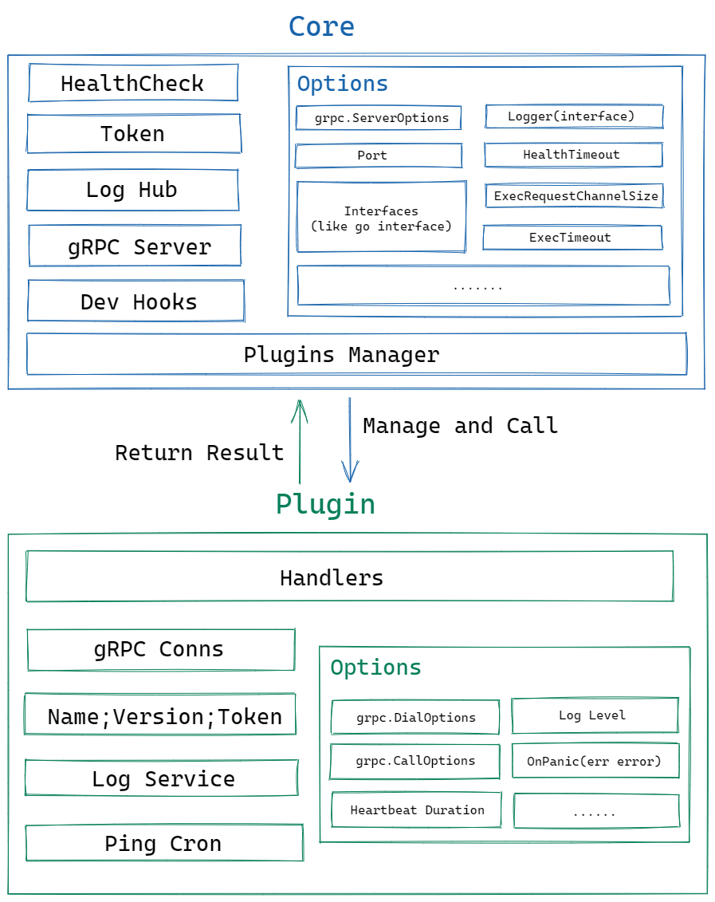
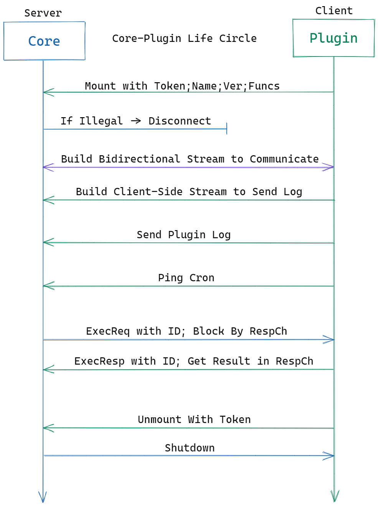
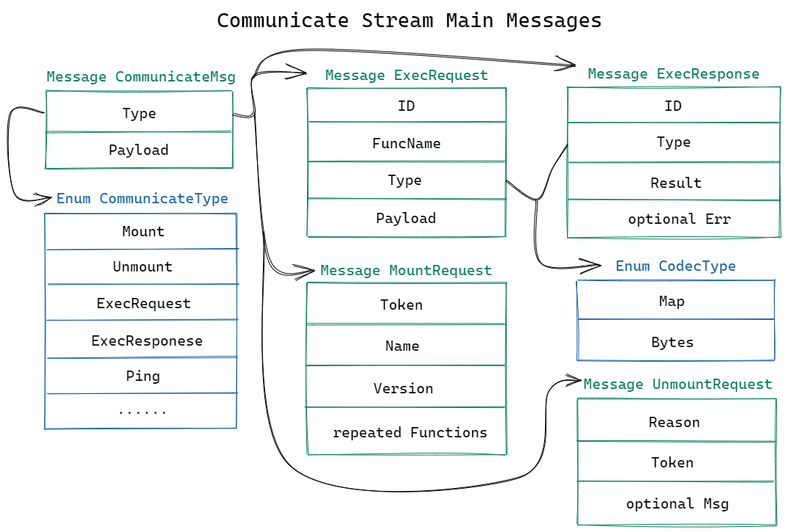
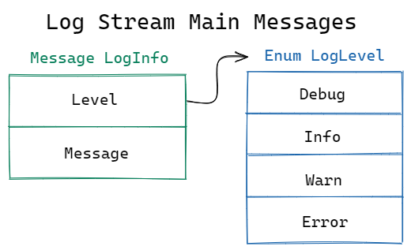

# 项目名称

一种基于 gRPC 的轻量级应用间双向通信框架

# 项目方案

## 背景

正如项目描述，`Go` 原生 `Plugin` 实现的问题多、限制大，并不适合作为插件机制来使用。在我的 `pure-live` 项目起步时，我对此也做过一番调研。跨平台限制、插件开发生命周期限制、兼容性限制均是不可接受的痛点。最终，我只能以代码耦合的形式暂时实现简单的插件设计。

同时，**`Plugin` 可谓  `DevStream` 的第一公民**，包含了大量的具体业务实现，如今因原生 `plugin` 限制了开发周期。插件的兼容、开发、迁移是方案需要考虑的一大重点。

借此次OSPP为契机，我想实现一个基于网络层的轻量插件框架，他将解决以下问题：

- **无法单独管理不同插件的维护周期，牵一发而动全身。**低耦合的插件设计下，项目扩展性、健壮性、灵活性将大大提高。
- **无法跨主机部署调用。**尽管在小项目中是不必要的，但对于大型项目应当是可选项。
- **插件的代码编写失误可能导致宿主出现崩溃。**
- **对 `DevStream` 已有插件机制兼容，降低迁移成本**。

## 对已有开源实现的评估

在了解需求之后，本着“不重复造轮子”的原则，先尝试寻找已有的开源实现。

`go-plugin` 是 `hashicorp` 于2016年开始提交的仓库，如今经过了4年多的生产环境验证，已用于许多著名开源项目。

如此优秀的项目，是否可以直接用于这次的 `OSAPP` ？**我认为是否定的**，在阅读其源码以及历史 `commits` 后，以下是我认为 `go-plugin` 存在的一些问题：

- **代码实现历史包袱重。**其支持 `net/rpc` 与 `gRPC` 两种通信底层。`gRPC` 为后期添加，`net/rpc` 如今已基本弃用。由于项目从2016年1月开始维护，2017年六月开始加入 `gRPC` 支持。所以源码中使用了大量的接口为 `net/rpc` 做向下兼容，源码阅读也十分困难，不利于长期维护。

- **只支持本机插件。**`go-plugin` 以 `exec.Command` 的方式启动插件，以 `process id` 检查插件存活。这就完全无法将插件系统在云原生上组织。同时 `pid` 这种强依赖操作系统的检查也一定程度上增加了跨平台难度。

- **日志系统可扩展性差。**由于只支持本机系统，`go-plugin`的日志采用 `stdout/stderr` 方式直接 `copy` 到宿主进程。`stdout/stderr` 的灵活性比网络传输差，难以做云原生迁移。

- **需要开发者大量封装。**`hashicorp/go-plugin` 需要开发者提前封装接口、选择适配序列化协议、中间转换函数，过程冗杂，代码量高，不符合“轻量”目标。

## 实现方案

先对以上问题做出方案回应：

- **采用 `gRPC` 为唯一支持协议。**`net/rpc` 不支持跨语言，兼容性差。在维护力度、性能方面与 `gRPC` 差距也较大。我认为可以直接抛弃协议兼容性，采用 `gRPC` 为唯一支持协议，简化具体实现。另一方面站在巨人的肩膀上，`gRPC` 已自带 `TLS` `Metadata` 等通用组件。
- **插件与宿主完全采用网络通信、反转插件与宿主的 `C/S` 关系。**避免进程启动、`stdout/stderr` 日志汇集等操作系统层面的代码实现；默认实现健康检查、日志汇集；令宿主为 `Server` ，插件为 `Client` ，插件启动方式由上层管理。
- **多种传输类型支持、代码生成辅助开发**。默认支持 `[]byte` 和 `map[string]interface{}` 两种类型。开发者可根据需求任意选择；代码生成增强编译期约束，减少低级错误。

以下为详细方案实现：

**注意：框架运行的前提为 `Core` `Plugin` 互相信任，无恶意开发者。框架不会着力解决合法性问题**

### 概述

框架封装底层通信协议，支持多种参数传输类型，内置健康检查与日志系统，预留足够的扩展性。以向上层提供轻量、易用的类与工具，开发者可以快速搭建起属于自己项目的插件机制。

### 核心概念

了解核心概念有利于把握整体。方案中的核心概念并不多，且非常容易理解，设计方案努力保证“轻量”“易用”的目标。

#### Core

`Core` 为宿主，它是一个项目的核心实现，主要包含项目逻辑，基本不包含具体业务逻辑。开发者、用户通过 `Core` 调用插件中的函数。`Core` 被设计为 `Server` 。

#### Plugin

Plugin 为插件，它实现了 `Core` 所需的具体业务逻辑。`Plugin` 被设计为 `Client` 。

#### Convention/约定

设计方案**倾向于“约定”而非“约束”**，如果想和 `go-plugin` 一样做到强约束，开发者必须付出大量时间对约束性做出封装。而对于一个小型、轻量的项目，约束应当只是可选项。`Core` 与 `Plugin` 之间的插件名、版本、函数名、参数类型、结果类型应尽可能先约定，后约束。

当然，对于一个大型项目，**“约束”不应当被完全抛弃**。下文将说明框架如何实现一定的约束性。

#### Interface

`Core` 可以定义多个 `interfce` 。相似但不同于 `Golang` 中的 `interface` ，为了贯彻单一职责，**一个 `Plugin` 只允许实现 `Core` 的一个接口，履行一项职责。**

#### Func/Handler

在 `Plugin` 注册的业务逻辑函数被称为 `Func/Handler` 。函数签名为 `func(ctx plugin.Context) (interface{}, error)` 。其接收来自 `Core` 的参数，进行处理后将结果返回给 `Plugin` ，`Plugin` 替它向 `Core` 发送结果。

### 协议

- `gRPC Bidirectional Streaming` 为 `Main Stream` ，用于传输除 `Log` 以外的所有消息。
- `gRPC Client-Side Streaming` 为 `Log Stream`，只用于传输 `Plugin Log`。
- `ProtoBuf` 为传输消息的序列化协议。

### 架构图



`Core` 包含以下组件：

- `Plugins Manager` ： 记录 `Plugin` 信息、状态，拥有管理权。
- `gRPC Server` ：承载起 `Core` 与所有 `Plugin` 的通信。
- `Mount Validation` ： 对于 `Mount` 过程， `Core` 有复杂的合法性校验过程。
- `Log Hub` ：负责收集 `Plugin` 日志并与 `Core` 日志统一处理。
- `Health Check Cron` ：健康检查定时任务，`Core` 将定时检查 `Plugin` 健康状态。
- `Developer Hook` ：框架使用者可以对框架内诸多事件进行外部监听。

`Plugin` 包含以下组件：

- `Handlers` ：在初始化阶段，`Plugin` 开发者注册需要暴露的函数，全部保存在 `Handlers` 中。
- `gRPC Conns` ：承载起 `Plugin` 与 `Core` 的通信。
- `Log Service` ：所有由此发起的日志消息全部被 `Core` 收集并处理。
- `Ping Cron` ：定时向 `Core` 发起一次通信保持存活状态。

### `Core`-`Plugin` 生命周期



`Core` 与 `Plugin` 的交互过程是复杂的但有效的，不过框架已经解决了这些繁琐的事情，开发者只需要关注插件逻辑编写。

以下为 `Core` 与 `Plugin` 的一次交互全过程，具体消息体说明请参考 “ProtoBuf设计” 部分。

#### 1. Core.Serve

`Core` 首先启动自身，对指定端口开始监听，等待 `Plugin` 向自身发起请求。

同时启动 `HealthCheck` 定时任务，对 `Plugins Manager` 记录的 `Plugin` 开展健康检查。

#### 2.Plugin.Mount

`Plugin` 由上层以任何方式启动，携带自身信息向 `Core` 发起 `Communicate Stream` 连接，随后立即发送 `protobuf.Communicate.MountRequest` 消息。

若合法性校验未通过，`Core` 直接断开 `Communicate Stream` 连接。

若合法性校验通过，`Plugin` 将再次发起请求建立另一条 `Log Stream` 连接用于发送日志。

至此，`Plugin` 成功 `Mount` 至 `Core` ，`Plugins Manager` 将记录所有信息并接管该 `Plugin`。

**注意：在 `Plugin` 成功 `Mount` 前，其他任何消息都会被直接丢弃。**

#### 3.  Plugin.Ping

成功 `Mount` 后，`Plugin` 立即启动 `Heartbeat` 定时任务，定时向 `Core` 汇报自身信息和存活状态，发送 `protobuf.Communicate.Ping` 消息。

若 `Plugin` 心跳丢失，将被 `Plugins Manager` 移除并断开连接，`Core` 请求调用时将直接返回 `Plugin Not Found` 错误。只有再次发起 `protobuf.Communicate.MountRequest` 才可以重新被接管。

#### 4. Plugin.Log

`Plugin` 通过 `Log Stream` 发送 `protobuf.Log.LogInfo` 消息记录日志。所有日志经过内部 `LogLevel` 筛选后向 `Core` 汇聚，由 `Core` 统一处理。

框架为 `Plugin` 提供了 `Log Service` ，封装了整个日志发送过程，也是插件开发者推荐使用的日志方式。

#### 5. Core.ExecRequest

`Core` 使用 `sync.Map` 存储所有 `Exec` 结果，其可读形式为 `map[ExecID]ExecRespChannel`。

`Core` 将为一次 `Call` 调用配置 `ExecID` ，新建 `ExecRespChannel` 存入 `sync.Map` ，向指定 `Plugin` 发送 `protobuf.ExecRequest` 消息体。

`Call` 函数被 `RespChannel` 阻塞，并等待 `Plugin` 执行函数后返回结果。

#### 6.Plugin.ExecResponse

若成功返回结果，对 `sync.Map[ExecID]` 的 `ExecRespChannel` 传入执行响应。`Call` 函数恢复，向上层返回结果。

若执行时间大于 `Core.opts.ExecTimeout` ，直接返回 `exec timeout` 错误。

无论结果，`Core` 都将对资源进行回收、删除。

#### 7.Plugin.Unmount && Core.Shutdown

效果均为 `Plugin` 被 `Plugins Manager` 移除。

区别： `Unbind` 为 `Plugin` 因自身原因主动退出， `Shutdown` 为 `Core` 强制移除 `Plugin`

### `ProtoBuf` 设计



在 `Communicate Stream` 中，所有消息均被 `Communicate Msg` 包装，`Type` 字段定义此次消息类型，`Core` 与 `Plugin` 根据消息类型做出指定动作。

以下为主要消息体设计说明：

#### MountRequest(挂载请求)

- **`Token` ：连接令牌。**须与 `Core` 提前约定。
- **`Name` ：插件名。**用于标识插件、日志输出显示。
- **`Version` ：插件版本。**`Name` + `Version` 对于一个 `Core` 须全局唯一。
- **`Functions` ：函数列表。**由插件开发者注册，用于验证 `Core Interface` 。

#### UnmountRequest(卸载请求)

- **`Reason` ：卸载理由。**
- **`Token` ：卸载令牌。**同 `MountRequest` 中的 `Token`。
- **`Msg` ：可选的附加信息。**

`Reason` + `Msg` 用于为 `Core` 提供有效易读的卸载信息。

#### ExecRequest(执行请求)

- **`ID ` ：执行ID。**用于全局唯一标识此次执行请求。

- **`FuncName` ： 执行函数名。**指向 `Handlers` 中存在的函数。

- **`Type` ：“参数”编码类型。**目前支持 `Map(map[string]interface{})` 与 `Bytes([]byte)` ，由 `codec` 包控制，已预留扩展性。

- **`Payload` ：编码后的数据负载。**
  
  - `Map` ：由 `msgpack` 实现序列化/反序列化。适合轻量、约定为主的项目使用。
  
  - `Bytes` ：为开发者提供了自由选择序列化协议的渠道。例如：开发者可以自己定义具体业务的 `protobuf messages` ，在 `Core` `Plugin` 两侧自行实现序列化/反序列化。
  
  - 更多内置传输类型将被支持。同时底层序列化协议的修改不会影响上层开发者使用。


#### ExecResponse(执行响应)

- **`ID` ：执行ID。**用于全局唯一标识此次执行请求。同 `ExecRequest` 的 `ID` 。
- **`Type` ：“结果”编码类型。**同 `ExecRequest` 的 `Type` 。
- **`Result` ：“结果”编码类型。**同  `ExecRequest` 的 `Payload` 。
- **`Err` ：函数错误(可选)。**函数执行后若返回 `err != nil` ，在通信层面将携带此字段，最终由 `Core` 返回给上层。




在 `Log Stream` 中，目前只有 `LogInfo` 一种消息体。将日志传输单独设为一条连接，避免大量日志传输影响主连接“调用函数”的性能。

#### LogInfo

- **`Level` ：日志等级。**可以为 `Debug` `Info` `Warn` `Error` 。
- **`Message` ：日志内容。**

### Codec  与 MapConv 设计

#### Codec Interface 设计

编码类型解耦出 `codec` 包，负责 `Args` `Result` 的底层编解码。

```go
// package plugin
type HandlerFunc func(ctx Context) (interface{}, error)

type Context interface {
	codec.Union
	Plugin() *Plugin // get self
	L() *Logger      // Log Service
}

// package core
type Result interface {
	codec.Union
}

// package codec
type Union interface {
	Map() *shared.MapConv   // get MapConv when CodecType = Map, otherwise panic
	Bytes() []byte          // get Bytes when CodeType = Bytes, otherwise panic
	Type() shared.CodecType // get CodecType
}
```

#### `Args` `Result`  自由约定

由于双向支持 `CodecType` ，可以完全自定义单边编码类型：

| ExecArgs | ExecResult |
|:--------:|:----------:|
|   Map    |    Map     |
|   Map    |   Bytes    |
|  Bytes   |    Map     |
|  Bytes   |   Bytes    |
|  ......  |   ......   |

其他编码类型支持后，将衍生出更多组合。

#### MapConv 支持

上文提到，框架支持 `map[string]interface{}` 的简便传输方案(也是为了能直接兼容 `DevStream` 目前的插件设计)，但使用者需要多次断言、判定、赋值。

所以为了优化 `Map` 的使用，框架提供了 `MapConv` ，接收者可以直接通过 `ctx.Map().Getxxx()` 获取需要的值。

#### 使用 `msgpack` 序列化/反序列化 `map[string]interface{}`

为什么选择 `msgpack` 而不是 `protobuf` ？因为 `protobuf` 序列化 `map[string]interface{}` 需要使用 `google/protobuf/struct.proto` 序列化过程会将所有数字类型转为 `float64` 导致精度丢失。

而 `msgpack` 会保留原有类型，甚至对 `time.Time` 等内置类型也做了适配。同时 `msgpack` 的语言兼容度、性能、资源占用与 `protobuf` 差距不大。为了数据安全性考虑选择 `msgpack` 。

### 加强约束性

方案最开始提到当前 `Core` `Plugin` 双方依赖“约定”，这在小型项目中是加快开发速度，减少代码的利器。但在中大型项目中“约束”依旧是必选项，如何约束  `PluginName` `PluginVersion` `FuncName` `ArgsMap` `ResultMap`  ？

我使用**代码生成**的方式实现约束性。框架将提供 `CLI` 工具，并需要开发者按照 `Recommanded Project Layout` 开发项目。

在项目根目录下建立 `.goplugin` 文件夹，每个 `Name-Version.yaml` 代表一个插件，内容做出类似如下约束：

```yaml
# Math-v1.yaml
name: Math
version: v1
functions:
  - name: Plus
    args:
      - name: a
        type: int64
      - name: b
        type: int64
    result:
      - name: v
        type: int64
  - name: Minus
    args:
      - name: a
        type: int64
      - name: b
        type: int64
    result:
      - name: v
        type: int64
```

使用 `CLI` 运行类似如下命令：

```shell
./cli create # or
./cli create -f customdir/Math-v1.yaml # or
./cli create -d customdir
```

框架将帮助您生成 `Plugin` `Core` 的对接模板

此时， `PluginName` `PluginVersion` `FuncName` `ArgsMap` `ResultMap` 都将被预定义而无需手写。

# 项目开发时间计划

## 月规划

| 时间 |                             规划                             |
| :--: | :----------------------------------------------------------: |
| 7月  | 了解项目当前插件机制实现；学习 `Golang` `gRPC` `ProtoBuf` 等前置知识；开始搭建项目结构 |
| 8月  | 实现项目 `Core` `Plugin` 各模块的主要功能；编写单元测试；灵活变更方案选型 |
| 9月  |     细节完善；编写文档；调试Bug；开始尝试迁移原项目插件      |

## 周规划

### 7月

|  时间  |                             规划                             |
| :----: | :----------------------------------------------------------: |
| 第一周 | 学习 `Golang` 网络相关知识；了解 `Golang` 原生 `Plugin` 实现痛点；实践网络编程，编写简单DEMO |
| 第二周 | 学习 `gRPC` 框架，能够编写简单的 `C/S` DEMO；了解工业界当前 `gRPC` 最佳实践 |
| 第三周 | 学习 `ProtoBuf` ，能使用 `protoc-gen-go` 生成 `Golang` 代码；能够将其与 `gRPC` 结合 |
| 第四周 | 开始搭建项目结构，按照方案设计各自结构体；与导师沟通项目结构可行性 |

### 8月

|  时间  |                             规划                             |
| :----: | :----------------------------------------------------------: |
| 第五周 | 根据实际开发进程修改方案细节；实现 `Core.Serve` `Plugin.Mount` ；编写对应单元测试 |
| 第六周 | 实现 `Core.ExecRequest` `Plugin.ExecResponse` ；编写对应单元测试 |
| 第七周 | 实现 `HealthCheck`  `Log Service` `Plugin.Ping` ；编写对应单元测试 |
| 第八周 |   实现 `Codec` `MapConv` 等剩余部分代码；编写对应单元测试    |

### 9月

|   时间   |                             规划                             |
| :------: | :----------------------------------------------------------: |
|  第九周  |     完善主要代码其他细节；优化代码实现；重构部分主要代码     |
|  第十周  | 编写 `README`  `Tutorial(可选)`；完善代码注释；与导师校对相关场景和需求 |
| 第十一周 |             编写 `Examples` ，调试程序，解决BUG              |
| 第十二周 | 开始尝试迁移 `DevStream` 原有插件，排查相关错误并优化代码、文档 |

